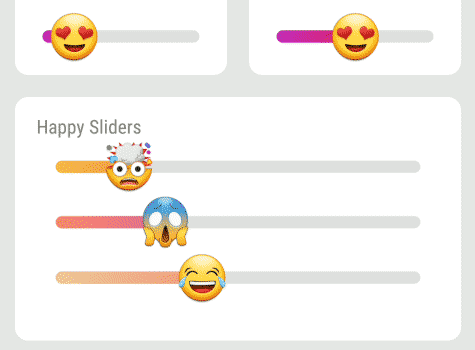

<p align="center"></p>
Emoji Slider
============

A custom made SeekBar **heavily** inspired by [this great widget from Instagram](https://instagram-press.com/blog/2018/05/10/introducing-the-emoji-slider/)

# Usage
Add a dependency to your `build.gradle`:
```groovy
dependencies {
    compile 'com.bernaferrari:emojislider:0.1'
}
```

# Features
- Customize with xml using custom handy attributes.
- Customize in your activity, fragment or dialog.
- Styling with your own widget.
- Creating newly widget from activity, fragment or dialog.


## Basic usage
Place the `EmojiSlider` in your layout.
```groovy
<com.bernaferrari.emojislider.EmojiSlider
    android:id="@+id/slider"
    android:layout_width="match_parent"
    android:layout_height="wrap_content"/>
```

**Important:** if you want ot have the emoji floating above the slider when it is pressed/dragged, you need to supply a view to be drawn and tell the slider who the view is.
Example:

```groovy
<?xml version="1.0" encoding="utf-8"?>
<FrameLayout xmlns:android="http://schemas.android.com/apk/res/android"
    xmlns:app="http://schemas.android.com/apk/res-auto"
    android:layout_width="wrap_content"
    android:layout_height="wrap_content">

    <com.bernaferrari.emojislider.EmojiSlider
        android:id="@+id/slider"
        android:layout_width="match_parent"
        android:layout_height="match_parent"
        android:padding="72dp" />

    <View
        android:id="@+id/slider_particle_system"
        android:layout_width="match_parent"
        android:layout_height="match_parent" />

</FrameLayout>
```

```kotlin
   findViewById<EmojiSlider>(R.layout.slider).sliderParticleSystem = slider_particle_system
```

To track the current position of the slider, set the `positionListener`, as shown below:
```
val slider = findViewById<EmojiSlider>(R.id.slider)
slider.positionListener = { p -> Log.d("MainActivity", "current position is: $p" )}
```

You can also track the beginning and completion of the movement of the slider, using the following properties:
`startTrackingListener` and `stopTrackingListener`. Examples below:
```
slider.startTrackingListener = { /* action on slider touched */ }
slider.stopTrackingListener = { /* action on slider released */ }
```

Here is simple example, how to change `EmojiSlider` range.
```kotlin
// Kotlin
val slider = findViewById<EmojiSlider>(R.id.slider)
slider.position = 0.3f
slider.startText ="$min"
slider.endText = "$max"
```

```java
// Java
final FluidSlider slider = findViewById(R.id.slider);
slider.setStartTrackingListener(new Function0<Unit>() {
    @Override
    public Unit invoke() {
        Log.d("D", "setBeginTrackingListener");
        return Unit.INSTANCE;
    }
});

slider.setStopTrackingListener(new Function0<Unit>() {
    @Override
    public Unit invoke() {
        Log.d("D", "setEndTrackingListener");
        return Unit.INSTANCE;
    }
});

// Or Java 8 lambda
slider.setPositionListener(pos -> {
    Log.d("D", "setPositionListener");
    return Unit.INSTANCE;
});
```

Here are the attributes you can specify through XML or related setters:
* `emoji` - the current emoji.
* `progress` - Initial position for the progress in range from 0.0 to 1.0.
* `average_progress` - Initial position for the average value in range from 0.0 to 1.0.
* `bar_progress_color_start` - Color of the start (left side) of the progress bar. Default is purple.
* `bar_progress_color_end` - Color of the end (right side) of the progress bar. Default is red.
* `bar_track_color` - Color of the bar's track. Default is light-grey.
* `thumb_size_percent_on_pressed` - Thumb size automatically shrinks to 90% (0.9) its original size when a touch is detected. This allows to choose another value between 0.0 and 1.0.
* `allow_reselection` - Should the slider behave like the original [Emoji Slider](https://instagram-press.com/blog/2018/05/10/introducing-the-emoji-slider/) or like a SeekBar? When true, it behaves like a SeekBar, so average/profile/result will not be shown.
* `is_touch_disabled` - Allow to disable touch input. Default is false.
* `should_display_tooltip` - Allow to disable the tooltip when a value is selected.
* `should_display_average` - Allow to disable the average circle when a value is selected. If this is disabled, tooltip will not be shown even if it is enabled.

* `register_touches_outside_thumb` - The original Emoji Slider only registers touch inside the thumb. The SeekBar register on the bar, too. This allows to choose which best suits you. Default is true, for better UX.
* `particle_direction` - Should the floating emoji go up or down after finger leaves the bar? Default is up.

## Reselection Enabled

| Up | Down |
|:-:|:-:|
|  |  |


## Screenshots

| Main Screen | Main Screen |Custom Screen|Custom Screen|
|:-:|:-:|:-:|:-:|
|  |  |  |  |

### Reporting Issues

Issues and Pull Requests are welcome.
You can report [here](https://github.com/bernaferrari/EmojiSlider/issues).

License
-------

Copyright 2018 Bernardo Ferrari.

Licensed to the Apache Software Foundation (ASF) under one or more contributor
license agreements.  See the NOTICE file distributed with this work for
additional information regarding copyright ownership.  The ASF licenses this
file to you under the Apache License, Version 2.0 (the "License"); you may not
use this file except in compliance with the License.  You may obtain a copy of
the License at

http://www.apache.org/licenses/LICENSE-2.0

Unless required by applicable law or agreed to in writing, software
distributed under the License is distributed on an "AS IS" BASIS, WITHOUT
WARRANTIES OR CONDITIONS OF ANY KIND, either express or implied.  See the
License for the specific language governing permissions and limitations under
the License.
