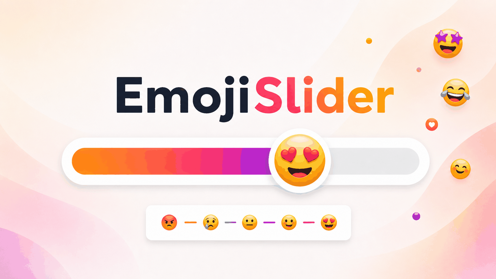

<div align="center">

# EmojiSlider

<a href="https://bernaferrari.github.io/EmojiSlider/">
  
</a>

[Try the web example](https://bernaferrari.github.io/EmojiSlider/)

A playful Compose Multiplatform slider with an emoji thumb, floating reactions, and shared Android, desktop, and web support.

</div>

## Features

- Shared Compose API for Android, desktop, and WASM JS.
- Emoji thumb and floating release animation with bundled emoji font.
- Tap, drag, one-shot selection, and reselection modes.
- Custom colors, gradients, sizes, average marker, tooltip, and result image.

## Installation

```kotlin
dependencies {
    implementation("com.bernaferrari.emojislider:emojislider:1.0.0")
}
```

Library version source of truth: `emojislider/build.gradle.kts` → `mavenPublishing.coordinates(version = …)`. Keep the coordinate above in sync when releasing. See [docs/RELEASING.md](docs/RELEASING.md).

## Testing / CI

Library tests live in `emojislider/src/commonTest` (pure logic) and `emojislider/src/desktopTest` (Compose UI / semantics):

```bash
./gradlew :emojislider:desktopTest
./gradlew :emojislider:spotlessCheck
```

[CI](.github/workflows/ci.yml) runs on every push and pull request: desktop compile (library + example), desktop tests, required Spotless, and a non-blocking wasmJs compile.

## Releasing

To cut a release: bump `version` in `emojislider/build.gradle.kts` (and this README), commit, tag `vX.Y.Z`, and push the tag. The [Release workflow](.github/workflows/release.yml) builds the library and creates a GitHub Release with generated notes. Maven Central publish is optional and runs only when repository secrets are configured.

Full steps, secret names, and dry-run options: **[docs/RELEASING.md](docs/RELEASING.md)**.

## Basic Usage

```kotlin
import androidx.compose.runtime.*
import androidx.compose.ui.graphics.Color
import com.bernaferrari.emojislider.EmojiSlider
import com.bernaferrari.emojislider.EmojiSliderColors

@Composable
fun RatingSlider() {
    var value by remember { mutableFloatStateOf(0.5f) }

    EmojiSlider(
        value = value,
        onValueChange = { value = it },
        emoji = "😍",
        colors = EmojiSliderColors(
            start = Color(0xFF7C3AED),
            end = Color(0xFFDB2777),
        ),
    )
}
```

## Floating Above Clipped Content

If the slider is inside a card, scroll container, or any clipped parent, wrap the screen with `EmojiSliderParticleSystem`. The slider will draw the floating emoji in the shared overlay instead of being clipped by its own bounds.

```kotlin
import androidx.compose.foundation.layout.fillMaxSize
import androidx.compose.ui.Modifier
import com.bernaferrari.emojislider.EmojiSlider
import com.bernaferrari.emojislider.EmojiSliderParticleSystem

@Composable
fun Screen() {
    EmojiSliderParticleSystem(modifier = Modifier.fillMaxSize()) {
        EmojiSlider(
            value = 0.6f,
            onValueChange = { /* update state */ },
        )
    }
}
```

Without `EmojiSliderParticleSystem`, `EmojiSlider` falls back to a local overlay, which is fine when the slider has enough vertical space and is not clipped.

## Reselection And One-Shot Modes

Use `allowReselection = true` when the slider should behave like a regular slider. Use `allowReselection = false` (default) when the first completed gesture should lock the selected value and reveal the average/result state.

```kotlin
EmojiSlider(
    value = value,
    onValueChange = { value = it },
    behavior = EmojiSliderBehavior(allowReselection = true),
)
```

## Average Indicator

```kotlin
EmojiSlider(
    value = value,
    onValueChange = { value = it },
    averageProgress = 0.72f,
    behavior = EmojiSliderBehavior(
        displayAverage = true,
        displayTooltip = true,
        tooltipText = "Average value",
    ),
)
```

## Main API

| Parameter | Default | Description |
| --- | --- | --- |
| `value` | required | Current slider value from `0f` to `1f`. |
| `onValueChange` | required | Called when user input changes the value. |
| `emoji` | `"😍"` | Emoji drawn as the thumb and floating particle. |
| `onStartTracking` | `{}` | Called when a tap or drag starts. |
| `onStopTracking` | `{}` | Called when tracking ends. |
| `colors` | `EmojiSliderColors()` | Start/end/track colors and active-track brush. |
| `behavior` | `EmojiSliderBehavior()` | Seekable, reselection, floating direction, average/result/tooltip. |
| `sizes` | `EmojiSliderSizes()` | Track, thumb, slider height, inset, particle min/max. |
| `averageProgress` | `0.5f` | Position of the average indicator. |
| `resultBitmap` | `null` | Optional result image drawn after selection. |

`EmojiSliderSizes.trackInset` defaults to half the thumb. Pass `0.dp` for an edge-to-edge track.

## Example App

The `:example` module shares one Compose UI across Android, desktop, and web.
```
